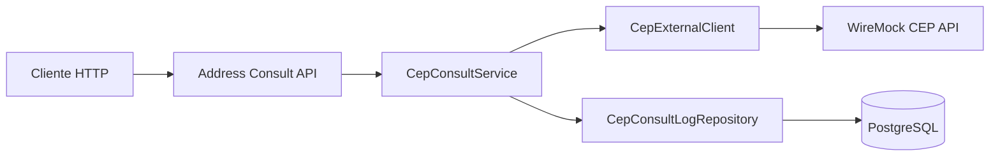

# Address Consult - Desafio NAVA Santander

Aplicacao Java para consulta de CEP em API externa mockada e persistencia dos logs de consulta em banco relacional.

## Tecnologias
- Java 21 (compativel com requisito Java 11+)
- Spring Boot 3
- Spring Web
- Spring Data JPA
- PostgreSQL
- Docker Compose
- WireMock

## Desenho da solucao


## Principios SOLID aplicados
- SRP: controller, service, client externo e repository com responsabilidades separadas.
- OCP/DIP: `CepConsultService` e `CepExternalClient` usam interfaces para facilitar extensao/substituicao.
- ISP: contratos pequenos e focados por camada.

## Endpoint principal
- `GET /api/ceps?cep=01001000`

Exemplo:
```bash
curl "http://localhost:8080/api/ceps?cep=01001000"
```

## Subindo ambiente
No diretorio `address-consult`:

```bash
docker compose -f compose.yaml up -d
./mvnw spring-boot:run
```

Servicos:
- API Spring Boot: `http://localhost:8080`
- WireMock (API externa mockada): `http://localhost:8081`
- PostgreSQL: `localhost:5432`

## Evidencia de log persistido
Cada consulta grava:
- CEP consultado
- data/hora da consulta
- todos os dados retornados pela API externa

Tabela: `cep_consult_log`

Consulta SQL:
```sql
select id, cep_consultado, data_hora_consulta, cep_retornado, localidade, uf
from cep_consult_log
order by data_hora_consulta desc;
```

## Roteiro de apresentacao (15 min)
1. Contexto e objetivo da aplicacao (1 min).
2. Desenho da solucao e fluxo da consulta (3 min).
3. Estrutura do codigo e SOLID (4 min).
4. Subida dos containers e aplicacao (3 min).
5. Chamada do endpoint e validacao no banco (4 min).

## Prazo do desafio
O enunciado cita finalizacao ate **05/05/2026**. Como hoje ja e **27/05/2026**, vale enviar o repositorio publico no Git o quanto antes e alinhar no email a data real de entrega.
